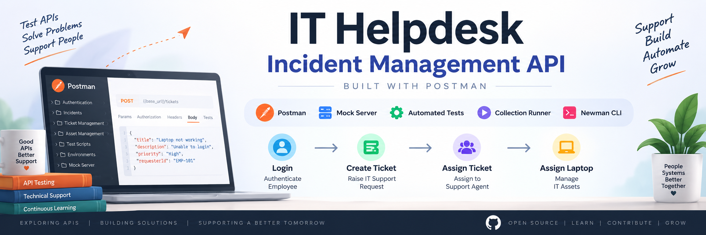
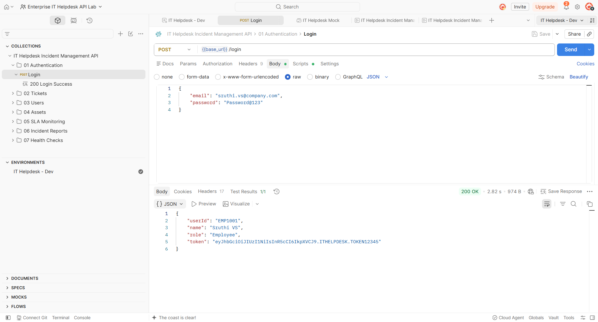
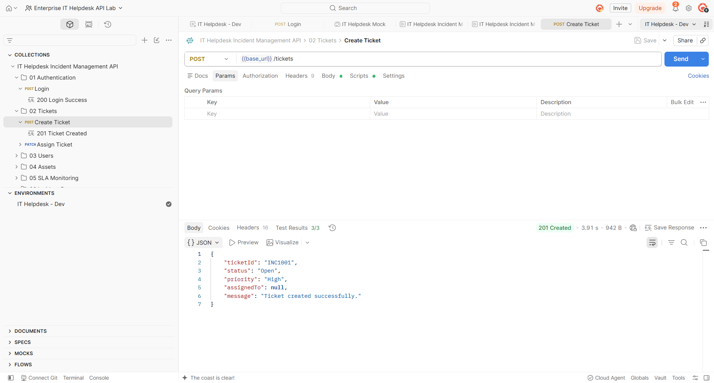
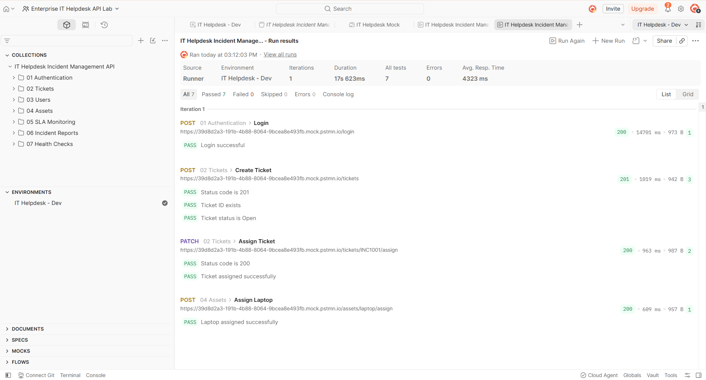
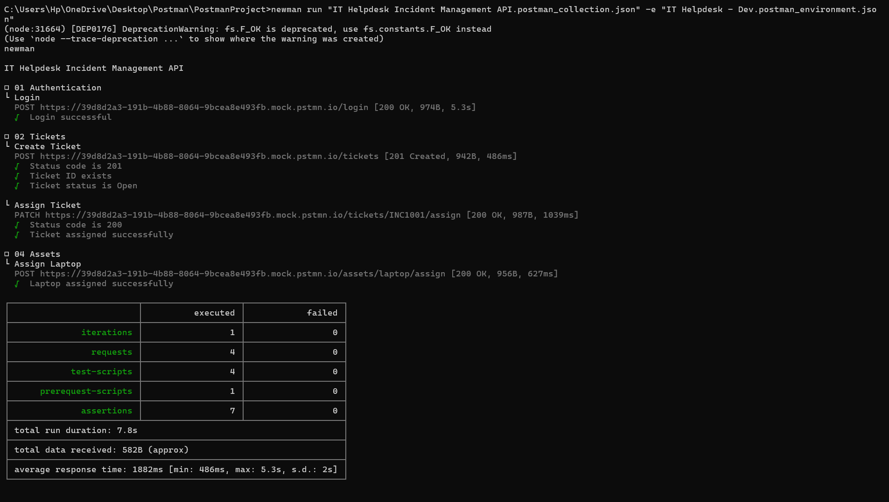

<p align="center">
  
</p>


# 🛠️ IT Helpdesk Incident Management API (Postman)

<p align="left">
  
  
  
  
  
</p>

A **real-world Technical Support portfolio project** built with **Postman** that simulates an IT Helpdesk ticket management system. This project demonstrates how support engineers interact with REST APIs to authenticate users, create incidents, assign tickets, manage IT assets, and validate API responses using automated Postman tests.

> **Status:** ✅ All 7 API requests and tests pass successfully using **Postman Collection Runner** and **Newman CLI**.

---

# 📌 Project Overview

This project recreates a simple enterprise IT Helpdesk workflow using a **Postman Mock Server** instead of a live backend.

It focuses on practical API testing skills used in Technical Support, API Support, QA, and SaaS Support Engineering roles.

### 🎯 Project Goals

- Simulate an IT Helpdesk ticket lifecycle.
- Test REST APIs using Postman.
- Automate API validation with JavaScript.
- Execute an end-to-end workflow using Collection Runner.
- Verify the entire collection with Newman CLI.

---

# ✨ Features

- 🔐 Employee Login Authentication
- 🎫 Create IT Support Ticket
- 👨‍💻 Assign Ticket to Support Agent
- 💻 Assign Laptop Asset to Employee
- 🌍 Environment Variables
- 🧪 Mock Server Integration
- ✅ Automated API Test Scripts
- 🔄 Collection Runner Workflow
- ⚡ Newman CLI Automation

---

# 🔄 IT Helpdesk Workflow

This project follows a complete support workflow similar to an internal employee helpdesk.

| Step | Action |
|------|--------|
| **1** | Employee Login Authentication |
| **2** | Create IT Support Ticket |
| **3** | Assign Ticket to Support Agent |
| **4** | Assign Laptop Asset to Employee |

The workflow demonstrates how data flows between multiple API requests using environment variables and automated tests.

---

# 🧰 Postman Skills Demonstrated

This project showcases practical Postman features beyond sending simple API requests.

| Postman Feature | How It's Used |
|-----------------|---------------|
| **Collections** | Organized API workflow. |
| **Mock Server** | Simulated backend API responses. |
| **Environment Variables** | Base URL and reusable variables. |
| **Collection Variables** | Shared data across requests. |
| **Pre-request Scripts** | Prepare request data before execution. |
| **JavaScript Test Scripts** | Validate API responses automatically. |
| **Collection Runner** | Run complete workflow in one click. |
| **Newman CLI** | Execute automated tests from terminal. |

---

# 🧪 API Endpoints

| Method | Endpoint | Purpose |
|--------|----------|---------|
| `POST` | `/login` | Authenticate employee login. |
| `POST` | `/tickets` | Create a new IT support ticket. |
| `PATCH` | `/tickets/{id}/assign` | Assign ticket to support engineer. |
| `PATCH` | `/assets/laptop/assign` | Assign laptop asset to employee. |

> The APIs are served through a **Postman Mock Server** for testing and demonstration.

---

# 📂 Project Structure

```text
IT-Helpdesk-Incident-Management-API/
│
├── README.md
├── IT-Helpdesk.postman_collection.json
├── Helpdesk.postman_environment.json
│
├── screenshots/
│   ├── login-api.png
│   ├── create-ticket-api.png
│   ├── assign-ticket-api.png
│   ├── assign-laptop-api.png
│   ├── test-run-7-of-7-passed.png
│   └── newman-test-passed.png
│
└── reports/
    └── newman-report.html
```

---

# 📸 API Screenshots

## 🔐 Login API

Employee authentication request and successful response.



---

## 🎫 Create Ticket API

Create a new IT Helpdesk support ticket.



---


# ✅ Automated Test Results

All requests include automated JavaScript assertions to validate API behavior.

### ✔ Collection Runner — 7/7 Tests Passed



### ✔ Newman CLI Test Results

The same Postman collection was executed through Newman CLI.



---

# 🧪 Example API Validation Tests

This project includes automated JavaScript test scripts for every request.

```javascript
pm.test("Status code is 200", () => {
    pm.response.to.have.status(200);
});

pm.test("Response contains ticket ID", () => {
    const response = pm.response.json();
    pm.expect(response.ticketId).to.exist;
});

pm.test("Response time is under 500ms", () => {
    pm.expect(pm.response.responseTime).to.be.below(500);
});
```

These tests validate:
- HTTP status codes.
- Response structure.
- Required fields.
- Performance expectations.

---

# 🚀 How to Run This Project

## 1️⃣ Clone the Repository

```bash
git clone <repository-url>
```

## 2️⃣ Import into Postman

Import:

- `IT-Helpdesk.postman_collection.json`
- `Helpdesk.postman_environment.json`

## 3️⃣ Select Environment

Choose the **Helpdesk Environment** before running requests.

## 4️⃣ Run Collection

Use **Collection Runner** to execute the entire workflow.

Expected Result:

- Login succeeds.
- Ticket is created.
- Ticket is assigned.
- Laptop asset is assigned.
- All tests pass.

## 5️⃣ Run Using Newman CLI (Optional)

```bash
newman run IT-Helpdesk.postman_collection.json \
-e Helpdesk.postman_environment.json
```

Expected Output:

```text
Iterations: 1
Requests: 7
Tests: 7
Passed: 7
Failed: 0
```

---

# 📄 Public API Documentation

Complete API documentation is available on Postman.

**🔗 Live Documentation**

https://documenter.getpostman.com/view/31876883/2sBYAuRAjJ

---

# 💡 Skills Demonstrated

- REST API Testing
- API Workflow Validation
- Technical Support Ticket Lifecycle
- Mock Server Testing
- JavaScript API Assertions
- Environment & Collection Variables
- Collection Runner Automation
- Newman CLI Automation
- Git & GitHub Documentation

---

# 🎯 Why I Built This Project

I created this project as part of my **Technical Support / API Support portfolio** to gain hands-on experience with Postman and enterprise-style support workflows.

This repository demonstrates practical API testing skills that are relevant for **Technical Support Engineer, API Support Engineer, Customer Support Engineer, and QA** roles at SaaS companies.

---

## 👩‍💻 Author

**Sruthi VS**

Building a hands-on Technical Support portfolio with **Postman, SQL, Jira, Zendesk, Chrome DevTools, OpenAI API, Slack, Notion, and GitHub**.

⭐ If you found this project useful, consider exploring the Postman documentation linked above.
